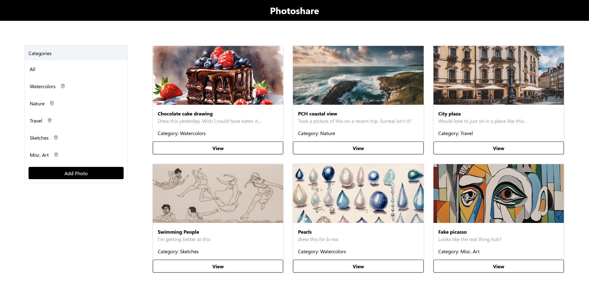

# PhotoShare: Your Personal Photo Sharing Platform

Welcome to PhotoShare, a dynamic and intuitive photo-sharing web application designed to streamline the management and sharing of your personal photo collections. With PhotoShare, organizing, categorizing, and accessing your cherished memories has never been easier. Built with cutting-edge technologies and a focus on user experience, PhotoShare offers a seamless and secure solution for storing and sharing your photos.

## Features

### Upload & Manage Photos
Easily upload your photos to your personal PhotoShare account, empowering you to curate and maintain your collection effortlessly.

### Sort & Categorize
Effortlessly sort and categorize your photos using customizable tags and metadata, ensuring your collection stays organized and easy to navigate.

### Smart Filtering
Quickly locate specific photos using advanced filtering options such as date, location, tags, and more, providing you with instant access to your most cherished memories.

### Secure AWS Integration
Leveraging the power of AWS S3 buckets, PhotoShare ensures the secure storage and scalability of your photo collection, giving you peace of mind knowing your memories are protected.

### Responsive Design
With a responsive design, PhotoShare adapts seamlessly to different devices and screen sizes, ensuring a consistent and enjoyable user experience whether you're accessing it from your desktop, tablet, or mobile phone.

## Technologies Stack

- **Backend**: Django, Django REST Framework
- **Frontend**: React, React Router
- **Database**: PostgreSQL
- **Cloud Storage**: AWS S3
- **Authentication**: JSON Web Tokens (JWT)
- **Styling**: CSS, Bootstrap

## Getting Started

To experience PhotoShare firsthand, follow these simple steps:

1. **Clone the Repository**: Clone the PhotoShare repository to your local machine.
    ```bash
    git clone https://github.com/yourusername/photoshare.git
    ```

2. **Install Dependencies**: Navigate to the project directory and install backend and frontend dependencies.
    ```bash
    cd photoshare/backend
    pip install -r requirements.txt

    cd ../frontend
    npm install
    ```

3. **Set Up Environment Variables**: Create a .env file in the backend directory and configure the necessary environment variables.
    ```makefile
    DATABASE_URL=your_database_url
    AWS_ACCESS_KEY_ID=your_aws_access_key_id
    AWS_SECRET_ACCESS_KEY=your_aws_secret_access_key
    AWS_STORAGE_BUCKET_NAME=your_s3_bucket_name
    DJANGO_SECRET_KEY=your_django_secret_key
    ```

4. **Run Migrations**: Apply database migrations to set up the database schema.
    ```bash
    python manage.py migrate
    ```

5. **Run Backend Server**: Start the Django backend server.
    ```bash
    python manage.py runserver
    ```

6. **Run Frontend Server**: In a separate terminal, navigate to the frontend directory and start the React frontend server.
    ```bash
    cd photoshare/frontend
    npm start
    ```

7. **Access PhotoShare**: Open a web browser and navigate to http://localhost:3000 to access the PhotoShare application.

## Contributing

We welcome contributions to PhotoShare! If you'd like to contribute, please fork the repository, make your changes, and submit a pull request. Be sure to follow the project's coding conventions and guidelines.

## License

PhotoShare is licensed under the MIT License.

## Contact

Have questions or suggestions regarding PhotoShare? Reach out to us at photoshare@example.com. We value your feedback and look forward to hearing from you!

Happy sharing your memories with PhotoShare! 📸✨
